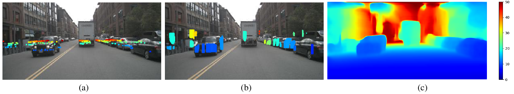

# Radar-Camera Pixel Depth Association for Depth Completion


**Example of radar-camera depth completion: (a) raw radar depth, (b) enhanced radar depth, (c) final predicted depth.**


## Directories
```plain
rc-pda/
    data/                           							 
        nuscenes/                 		    
                annotations/
                maps/
                samples/
                sweeps/
                v1.0-trainval/
    lib/
    scripts/
    external/                   				   	        
        panoptic-deeplab/       
        RAFT/                   	     				
```


## Setup
- Create a conda environment called pda
```bash
conda create -n pda python=3.6
```
- Install required packages
```bash
pip install -r requirements.txt
```
- Download [nuScenes dataset](https://www.nuscenes.org/) (Full dataset (v1.0)) into data/nuscenes/
- Clone external repos [Panoptic-DeepLab](https://github.com/bowenc0221/panoptic-deeplab) and [RAFT](https://github.com/princeton-vl/RAFT) into external/

## Code
**1. Data preparation**

```bash
cd scripts

# 1) split data
python split_trainval.py

# 2) extract images for flow computation
python prepare_flow_im.py

# 3) compute image flow from im1 to im2
python cal_flow.py 

# 4) compute camera intrinsic matrix and transformation from cam1 to cam2
python cal_cam_matrix.py 

# 5) transform image flow to normalized expression (u2,v2)
python cal_im_flow2uv.py  

# 6) compute vehicle semantic segmentation
python semantic_seg.py 

# 7) compute dense ground truth (depth1, u2, v2) and low height mask
python cal_gt.py  

# 8) compute merged radar (5 frames)
python cal_radar.py       

# 9) create .h5 dataset file
python gen_h5_file3.py           
```

**2. Estimate radar camera association**
```bash
python train_pda.py        # train
python test_pda.py         # test
```
Download [pre-trained weights](https://drive.google.com/drive/folders/13zBWTrfYAcDzwc0S8MCmve7C22b8iDxf?usp=sharing)

**3. Generate enhanced radar depth (RC-PDA)**

```bash
python cal_mer.py
```

**4. Train depth completion by using the enhanced depth**
- Depth completion scheme 1 ([Using depths and RGB as input channels](https://arxiv.org/pdf/1709.07492.pdf))

```bash
python train_depth.py        	# train
python test_depth.py         	# test
```
Download [pre-trained weights](https://drive.google.com/drive/folders/1ZB_77Af6gaUIW4NJLvNY8b_LaXjRELjJ?usp=sharing)

- Depth completion scheme 2 ([Multi-Scale Guided Cascade Hourglass Network](https://github.com/anglixjtu/msg_chn_wacv20))

```bash
python train_depth_hg.py        # train
python test_depth_hg.py         # test
```
Download [pre-trained weights](https://drive.google.com/drive/folders/1ofoMHAuQWOP2u3yusp_Tz0jXgeFrrMk3?usp=sharing).


## Citation
```plain
@InProceedings{Long_2021_CVPR,
    author    = {Long, Yunfei and Morris, Daniel and Liu, Xiaoming and Castro, Marcos and Chakravarty, Punarjay and Narayanan, Praveen},
    title     = {Radar-Camera Pixel Depth Association for Depth Completion},
    booktitle = {Proceedings of the IEEE/CVF Conference on Computer Vision and Pattern Recognition (CVPR)},
    month     = {June},
    year      = {2021},
    pages     = {12507-12516}
}
```


